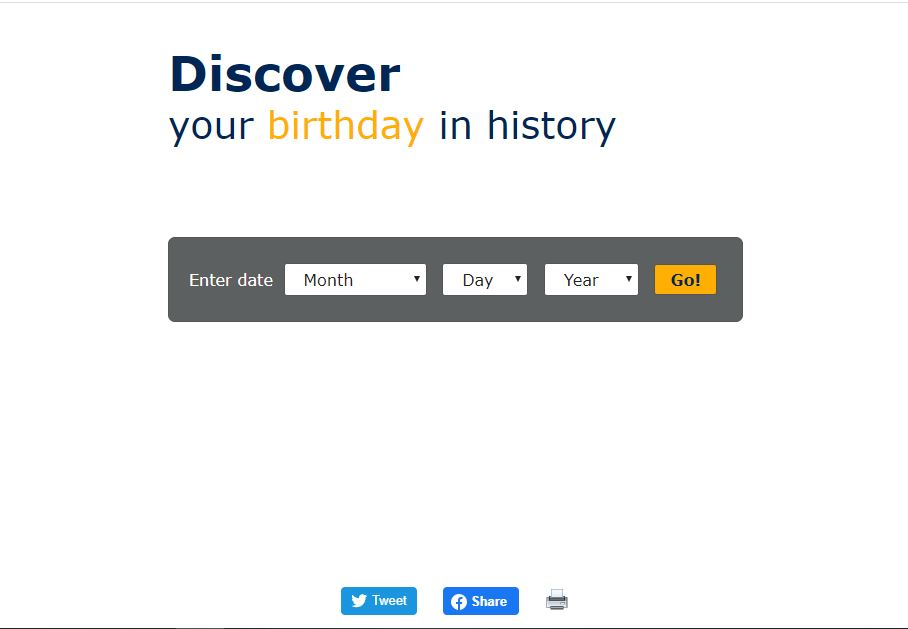
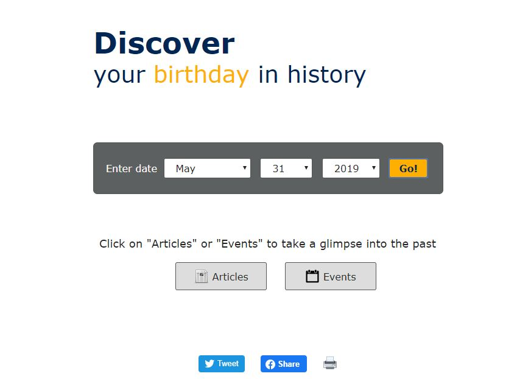
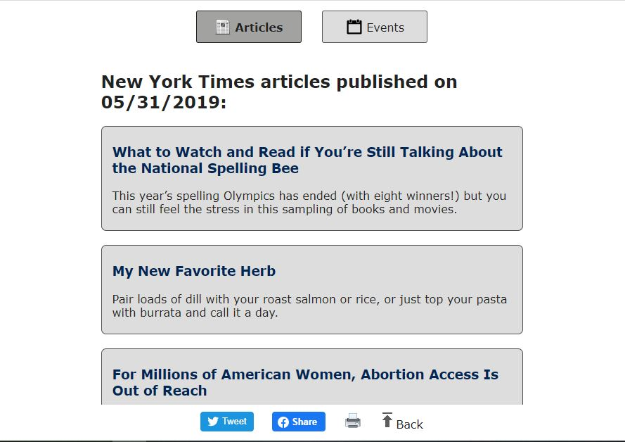
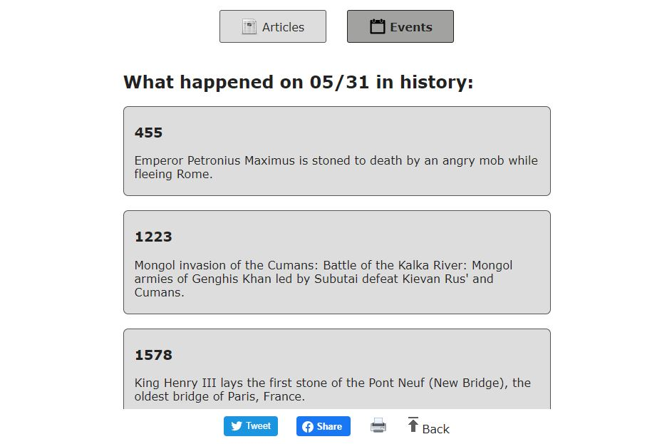

# Birthday-In-History
This application lets users learn more about their birth date in history
## How It Works
User enters birthday and clicks "Go". The app shows two options: "Articles" and "Events". "Articles" lists the New York Times articles published on the entered date; "Events" lists historic events that took place on the same month and day in different years between BC and current date. User can print results and share the app on social media 
## Start Exploring Right Now
[https://disiting.github.io/Birthday-In-History/]
## Here is What It Looks Like
### Landing Page

### Toggle Between Events and Articles

### Articles

### Events

## Built With
HTML, CSS, JavaScript, jQuery